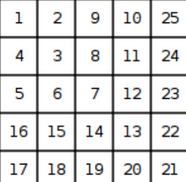

# Actividades propuestas

## Ejercicio 1: “Weird Algorithm”
Considera un algoritmo que toma como entrada un entero positivo n. Si n es par, el algoritmo
lo divide por dos, y si n es impar, el algoritmo lo multiplica por tres y le suma uno. El
algoritmo repite esto hasta que n sea uno. Por ejemplo, la secuencia para el valor 3 es la
siguiente:
```
3 ➝ 10 ➝ 5 ➝ 16 ➝ 8 ➝ 4 ➝ 2 ➝ 1
```

Tu tarea es simular la ejecución del algoritmo para un valor dado de n.
- Input:
El único parámetro de entrada contiene un entero n.
- Output:
Retorna una línea que contenga todos los valores de n durante la ejecución del algoritmo.
- Constraints:
```
1 < n < 10^6
```
Caso de prueba:
```py
assert weird_algorithm(3) == [3, 10, 5, 16, 8, 4, 2, 1], "Error en el caso de prueba"
```

## Ejercicio 2: “Missing Number”
Se te dan todos los números entre 1 a “n” excepto uno. Tu tarea es encontrar el número que
falta.

- Input:
El primer parámetro contiene la cantidad de elementos del array.
El segundo parámetro contiene “n” números. Cada número es único y está entre 1 y n
(inclusive).
- Output:
Retornar el número que falta.
- Caso de prueba:

```py
assert missing_number(5, [1, 2, 4, 5]) == 3, "Error en el caso de prueba"
```

## Ejercicio 3: “Number Spiral”
Un espiral numérico es una cuadrícula infinita cuyo cuadrado superior izquierdo tiene el
número 1. Aquí están las primeras cinco capas del espiral.



Tu tarea es descubrir el número en la fila x y la columna y.
- Input:
El primer parámetro contiene la posición de la fila de la matriz espiral
El segundo parámetro contiene la posición de la columna de la matriz espiral
- Output:
Retornar el valor de la matriz en la posición seleccionada.
- Caso de prueba:
```py
assert number_spiral(2, 2) == 25, "Error en el caso de prueba"
```

## Ejercicio 4: “Palindrome Reorder”
Dada una cadena de caracteres, tu tarea es reorganizar los caracteres de la cadena de manera
que puedas formar un palíndromo. Si no es posible formar un palíndromo, debes indicarlo.

- Input:
El único parámetro contiene una cadena de caracteres de longitud n ( 1 ≤ n ≤ 10^6 ). La
cadena solo contiene letras minúsculas del alfabeto inglés.
- Output:
Retorna una cadena que represente un palíndromo formado reorganizando los caracteres de la
cadena de entrada. Si no es posible formar un palíndromo, retorna "NO SOLUTION".
- Caso de prueba:

```py
assert palindrome_reorder("aabbc") == "abcba", "Error en el caso de prueba"
```
